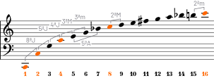
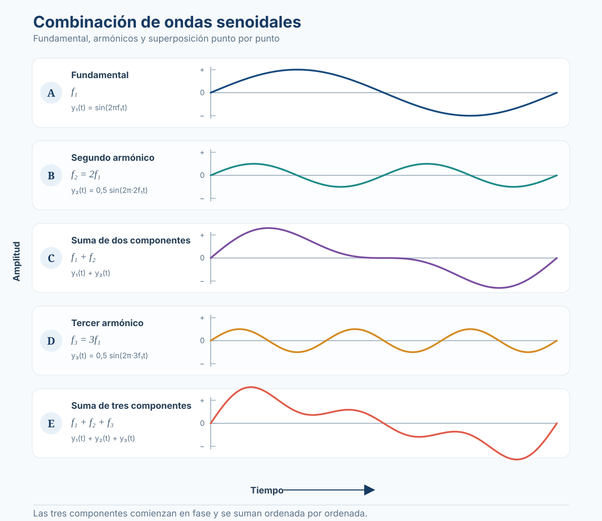
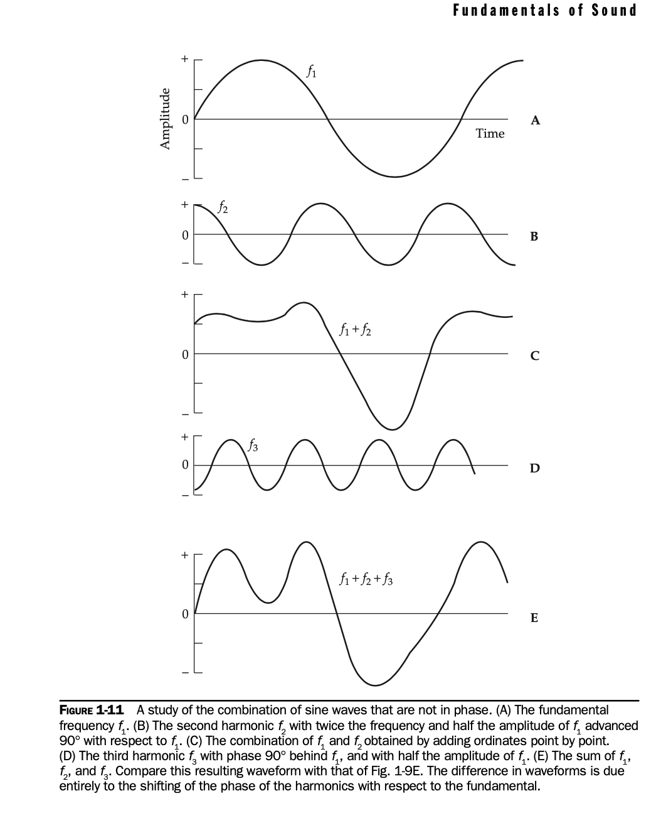

# Sesión 4: Del tono puro al timbre

**Armónicos, espectro, periodicidad y ruido**

---

??? info "Unidades y símbolos (glosario de referencia)"
    | Símbolo | Nombre | ¿Qué mide? | Equivalencia |
    |---|---|---|---|
    | **Hz** | Hertz | Frecuencia | 1 Hz = 1 ciclo/s |
    | **kHz** | Kilohertz | Frecuencia | 1 kHz = 1000 Hz |
    | **s** | Segundo | Tiempo | — |
    | **ms** | Milisegundo | Tiempo | 1 ms = 0.001 s |
    | **\(f\)** | Frecuencia | Ciclos por segundo | \(f=1/T\) |
    | **\(f_0\)** | Frecuencia fundamental | Primera componente de una serie | Suele definir la altura percibida |
    | **\(T\)** | Período | Duración de un ciclo | \(T=1/f\) |

!!! abstract "Objetivos de la sesión"
    Al finalizar, deberías poder responder:

    1. ¿Qué diferencia un **tono puro** de un **sonido complejo**?
    2. ¿Qué es un **armónico** y cómo se relaciona con la fundamental?
    3. ¿Por qué dos instrumentos tocando la misma nota pueden sonar diferentes?
    4. ¿Qué diferencia una señal **periódica** de una señal **aperiódica**?

---

## 1. Primero escuchamos: ¿una frecuencia o muchas?

Un **tono puro** contiene una sola frecuencia. La mayoría de los sonidos musicales son **complejos**: contienen muchas frecuencias simultáneas.

  <h4>🎧 Experimento 1 — Construye un sonido</h4>
  
Fundamental: Do3 ≈ 130.8 Hz. Escucha cómo cambia el sonido al añadir armónicos.

  

    <button type="button" class="audio-btn" data-play-harmonics="1">▶ Solo fundamental</button>
    <button type="button" class="audio-btn" data-play-harmonics="1,2">▶ + octava</button>
    <button type="button" class="audio-btn" data-play-harmonics="1,2,3">▶ + quinta</button>
    <button type="button" class="audio-btn" data-play-harmonics="1,2,3,4,5,6,7,8">▶ Primeros 8 armónicos</button>
  

  

!!! question "Escucha antes de leer"
    - ¿Sigues percibiendo aproximadamente una sola altura?
    - ¿Qué cambia más: la **altura** o el **timbre**?
    - ¿Qué ocurre cuando agregamos más componentes?

Joseph Fourier mostró que una onda periódica compleja puede representarse como suma de ondas sinusoidales.

> **Idea clave:** un sonido complejo puede analizarse como una combinación de componentes simples.

---

## 2. Fundamental, armónicos y parciales

La frecuencia fundamental se representa como \(f_0\).

Los armónicos son múltiplos enteros de esa frecuencia:

\[
f_n = n \cdot f_0
\]

Si:

\[
f_0 = 100\ \text{Hz}
\]

entonces:

\[
2f_0 = 200\ \text{Hz},\qquad
3f_0 = 300\ \text{Hz},\qquad
4f_0 = 400\ \text{Hz}
\]

| Término | Significado | Ejemplo |
|---|---|---:|
| **Fundamental** | Primer componente | 100 Hz |
| **2.º armónico** | \(2f_0\) | 200 Hz |
| **3.º armónico** | \(3f_0\) | 300 Hz |
| **Parcial** | Cualquier componente presente | 100, 215, 300 Hz… |

!!! warning "Armónico y parcial no son lo mismo"
    Todo armónico es un parcial, pero no todo parcial es armónico. Un parcial inarmónico no es un múltiplo entero exacto de una sola fundamental.

---

## 3. La serie armónica como mapa de intervalos

Tomemos como fundamental:

\[
C2 \approx 65.4\ \text{Hz}
\]

En lugar de memorizar dieciséis números, vamos a buscar **familias**.

  <h4>🎨 Explora la serie armónica</h4>

  

    <button type="button" class="harmonic-filter active" data-harmonic-filter="all">Todos</button>
    <button type="button" class="harmonic-filter" data-harmonic-filter="octaves">🔵 Octavas</button>
    <button type="button" class="harmonic-filter" data-harmonic-filter="fifths">🟠 Quintas</button>
    <button type="button" class="harmonic-filter" data-harmonic-filter="thirds">🟢 Terceras</button>
    <button type="button" class="harmonic-filter" data-harmonic-filter="sevenths">🟣 Séptima natural</button>
  

  

    Octavas: 1, 2, 4, 8, 16
    Quintas: 3, 6, 12
    Terceras: 5, 10
    Séptima natural: 7, 14
  

  

    
<strong>1</strong>C265.4 Hz

    
<strong>2</strong>C3130.8 Hz

    
<strong>3</strong>G3196.2 Hz

    
<strong>4</strong>C4261.6 Hz

    
<strong>5</strong>E4 ↓327.0 Hz

    
<strong>6</strong>G4392.4 Hz

    
<strong>7</strong>B♭4 ↓457.8 Hz

    
<strong>8</strong>C5523.2 Hz

    
<strong>9</strong>D5588.6 Hz

    
<strong>10</strong>E5 ↓654.0 Hz

    
<strong>11</strong>F♯/G♭ aprox.719.4 Hz

    
<strong>12</strong>G5784.8 Hz

    
<strong>13</strong>A♭ aprox.850.2 Hz

    
<strong>14</strong>B♭5 ↓915.6 Hz

    
<strong>15</strong>B5981.0 Hz

    
<strong>16</strong>C61046.4 Hz

  

  

    <button type="button" class="audio-btn" data-play-family="octaves">▶ Escuchar octavas</button>
    <button type="button" class="audio-btn" data-play-family="fifths">▶ Escuchar quintas</button>
    <button type="button" class="audio-btn" data-play-family="thirds">▶ Escuchar terceras</button>
    <button type="button" class="audio-btn" data-play-family="sevenths">▶ Escuchar séptima natural</button>
  

  

### 3.1 Octavas

Los armónicos:

\[
1,\ 2,\ 4,\ 8,\ 16
\]

corresponden a:

\[
C2 \rightarrow C3 \rightarrow C4 \rightarrow C5 \rightarrow C6
\]

Cada salto duplica la frecuencia:

\[
65.4 \rightarrow 130.8 \rightarrow 261.6 \rightarrow 523.2 \rightarrow 1046.4\ \text{Hz}
\]

Por eso la relación de octava es:

\[
\boxed{2:1}
\]

### 3.2 Quintas

La familia:

\[
3,\ 6,\ 12
\]

produce:

\[
G3 \rightarrow G4 \rightarrow G5
\]

La quinta aparece al comparar los armónicos 3 y 2:

\[
\boxed{\frac{3}{2}}
\]

### 3.3 Tercera mayor

La familia:

\[
5,\ 10
\]

produce la clase de altura Mi.

La relación entre los armónicos 5 y 4 es:

\[
\boxed{\frac{5}{4}}
\]

!!! note "Afinación natural y temperamento igual"
    Algunos armónicos no coinciden exactamente con las notas del piano afinado en temperamento igual. Por eso aparecen símbolos como **↓** o la indicación **aprox.**

### 3.4 Una idea visual útil

Podemos pensar la serie como varias familias superpuestas:

\[
\text{Octavas: } 1,2,4,8,16
\]

\[
\text{Quintas: } 3,6,12
\]

\[
\text{Terceras: } 5,10
\]

\[
\text{Séptima natural: } 7,14
\]

!!! info "Consonancia"
    Relaciones sencillas como \(2:1\), \(3:2\) y \(5:4\) producen coincidencias importantes entre componentes espectrales. Esto contribuye a la percepción de consonancia, aunque también influyen el timbre, el registro, la afinación y el contexto musical.

<figure markdown="span">
  
  <figcaption>Primeros 16 armónicos de Do2. Los intervalos se van comprimiendo a medida que aumenta el número de armónico.</figcaption>
</figure>

---

## 4. El timbre: misma fundamental, diferente espectro

Dos sonidos pueden tener la misma fundamental y sonar completamente distintos.

  <h4>🎧 Experimento 2 — Misma altura, diferente timbre</h4>
  
Todos tienen una fundamental cercana a 130.8 Hz. Escucha y observa qué armónicos aparecen en cada forma de onda.

  

    <button type="button" class="audio-btn" data-play-wave="sine">▶ Seno</button>
    <button type="button" class="audio-btn" data-play-wave="triangle">▶ Triangular</button>
    <button type="button" class="audio-btn" data-play-wave="square">▶ Cuadrada</button>
    <button type="button" class="audio-btn" data-play-wave="sawtooth">▶ Diente de sierra</button>
  

  

    <canvas data-spectrum-canvas aria-label="Analizador espectral en tiempo real"></canvas>
  

  

    <strong>f₀</strong> = 130,8 Hz
    Eje X: frecuencia
    Eje Y: nivel relativo en dB
  

  

!!! tip "Qué deberías ver"
    - **Seno:** prácticamente un solo pico en (f_0).
    - **Triangular:** armónicos impares (f_0, 3f_0, 5f_0,ldots), pero los superiores caen muy rápido.
    - **Cuadrada:** armónicos impares (f_0, 3f_0, 5f_0,ldots) con mayor presencia relativa.
    - **Diente de sierra:** aparecen armónicos pares e impares (f_0, 2f_0, 3f_0,ldots).

    La **fundamental no cambia**; cambia la distribución de energía entre sus armónicos. Eso es una parte central del timbre.

| Forma de onda | Contenido armónico idealizado |
|---|---|
| **Seno** | Solo \(f_0\) |
| **Triangular** | Armónicos impares con caída rápida |
| **Cuadrada** | Armónicos impares |
| **Diente de sierra** | Armónicos pares e impares |

Para la onda cuadrada:

\[
y(t)=\frac{4}{\pi}
\sum_{n=1,3,5,\ldots}^{\infty}
\frac{1}{n}\sin(2\pi n f_0t)
\]

Para la onda diente de sierra:

\[
y(t)=\frac{2}{\pi}
\sum_{n=1}^{\infty}
\frac{(-1)^{n+1}}{n}\sin(2\pi n f_0t)
\]

> **Idea clave:** el timbre depende mucho de qué componentes frecuenciales están presentes y de sus amplitudes relativas.

---

## 5. Dominio temporal y dominio frecuencial

| Dominio | Eje X | Eje Y | Muestra |
|---|---|---|---|
| **Temporal** | Tiempo | Amplitud | Forma de onda |
| **Frecuencial** | Frecuencia | Amplitud o nivel | Espectro |

Una sinusoide ideal produce una sola línea espectral. Un sonido armónico produce líneas en:

\[
f_0,\ 2f_0,\ 3f_0,\ 4f_0,\ldots
\]

Un ruido de banda ancha presenta energía distribuida de forma más continua.

---

## 6. Fase y forma de onda

La fase indica cómo se alinean las componentes en el tiempo:

\[
y(t)=
A_1\sin(2\pi f_0t+\phi_1)
+
A_2\sin(4\pi f_0t+\phi_2)
+
A_3\sin(6\pi f_0t+\phi_3)
+\ldots
\]

| Símbolo | Significado |
|---|---|
| \(f_0\) | Fundamental |
| \(nf_0\) | Armónico \(n\) |
| \(A_n\) | Amplitud |
| \(\phi_n\) | Fase |

<figure markdown="span">
  
  <figcaption>Suma de armónicos en fase.</figcaption>
</figure>

<figure markdown="span">
  
  <figcaption>Las mismas frecuencias y amplitudes pueden producir otra forma temporal si cambia la fase.</figcaption>
</figure>

---

## 7. Señales periódicas y aperiódicas

Una señal periódica cumple:

\[
x(t)=x(t+T)
\]

donde \(T\) es el período.

| Tipo | Comportamiento | Espectro típico | Ejemplo |
|---|---|---|---|
| **Periódica** | Repite un ciclo | Líneas discretas | Oscilador |
| **Cuasiperiódica** | Repite con pequeñas variaciones | Líneas variables | Voz sostenida |
| **Aperiódica** | Sin ciclo estable | Más continuo | Ruido, transitorios |

---

## 8. Ruido blanco, rosa y marrón

  <h4>🎧 Experimento 3 — Colores de ruido</h4>
  
Escucha a volumen moderado y compara el balance entre graves y agudos.

  

    <button type="button" class="audio-btn" data-play-noise="white">▶ Ruido blanco</button>
    <button type="button" class="audio-btn" data-play-noise="pink">▶ Ruido rosa</button>
    <button type="button" class="audio-btn" data-play-noise="brown">▶ Ruido marrón</button>
  

  

| Color | Densidad espectral de potencia | Energía por octava |
|---|---|---|
| **Blanco** | Constante por Hz | Aumenta ≈ \(+3\) dB/octava |
| **Rosa** | Proporcional a \(1/f\) | Aproximadamente constante |
| **Marrón** | Proporcional a \(1/f^2\) | Disminuye ≈ \(-3\) dB/octava |

!!! info "Atención con las pendientes"
    En una gráfica de **densidad espectral de potencia**, el ruido marrón \(1/f^2\) cae aproximadamente \(-6\) dB por octava. Al integrar la energía dentro de cada octava, la caída es aproximadamente \(-3\) dB por octava.

---

## 9. Cierre

La secuencia conceptual de la sesión es:

\[
\boxed{
\text{tono puro}
\rightarrow
\text{armónicos}
\rightarrow
\text{espectro}
\rightarrow
\text{timbre}
\rightarrow
\text{aperiodicidad}
\rightarrow
\text{ruido}
}
\]

!!! success "Comprueba si lo entendiste"
    1. Si \(f_0=100\) Hz, ¿cuáles son los primeros cinco armónicos?
    2. ¿Por qué \(1,2,4,8,16\) forman una familia de octavas?
    3. ¿Qué relación define una quinta justa en la serie armónica?
    4. ¿Qué diferencia espectral hay entre una sinusoide y una diente de sierra?
    5. ¿Por qué el ruido rosa suele sonar menos brillante que el blanco?

---

*Basado en: Everest, F. A. & Pohlmann, K. C. (2009). Master Handbook of Acoustics (5th ed.). McGraw-Hill.*
