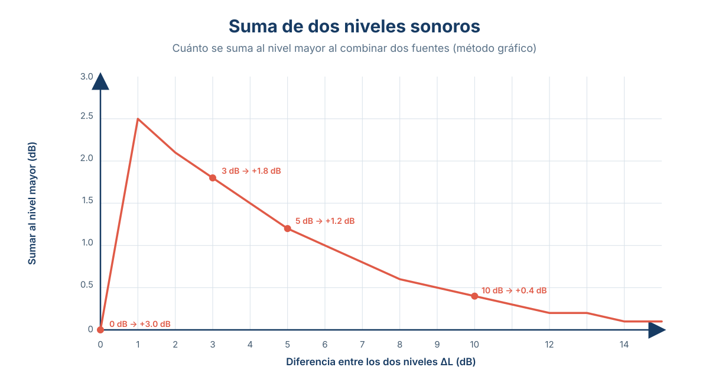

# Sesión 7: Suma y resta de niveles sonoros

---

??? info "Unidades y símbolos (glosario de referencia)"
    Consultá esta tabla cuando encuentres una unidad o símbolo que no conozcas. Cada término en el texto está vinculado a esta tabla.

    | Símbolo | Nombre | ¿Qué mide? | Equivalencia |
    |---|---|---|---|
    | **dB** | Decibel | Nivel relativo (escala logarítmica) | \( \text{dB} = 10\log_{10}(P/P_0) \) |
    | **dB SPL** | Sound Pressure Level | Nivel de presión sonora | Referencia: \(p_0 = 20\ \mu\text{Pa}\) |
    | **µPa** | Micropascal | Presión sonora | 1 µPa = 10⁻⁶ Pa |
    | **Pa** | Pascal | Presión | 1 Pa = 1 N/m² |
    | **Hz** | Hertz | Frecuencia | 1 Hz = 1/s |
    | **log₁₀** | Logaritmo en base 10 | Exponente al que hay que elevar 10 para obtener el número | log₁₀(100) = 2 |
    | **s** | Segundo | Tiempo | — |

???+ note "El error más común en acústica: sumar dB directamente"

    Dos parlantes idénticos, cada uno produciendo 70 dB SPL en un punto. Si encendemos ambos... ¿cuánto marca el sonómetro?

    Casi todos los estudiantes (y muchos músicos experimentados) responden: **140 dB SPL**. Es una respuesta intuitiva, lógica... y completamente equivocada.

    !!! danger "70 dB + 70 dB ≠ 140 dB"
        Los decibeles **no se suman linealmente** porque representan relaciones logarítmicas, no cantidades absolutas. Sumar dB directamente es como sumar los exponentes: \(10^3 + 10^3 = 2,000\), no \(10^6\). En dB: 70 dB SPL + 70 dB SPL = **73 dB SPL**, no 140 dB SPL.

    <figure markdown="span">
      
      <figcaption>**Fig. 2-5** — Nomograma de suma de niveles. La curva indica cuánto sumar al nivel mayor según la diferencia ΔL entre dos fuentes. Con fuentes iguales (ΔL = 0) se suman 3 dB; a mayor diferencia, menos aporta la fuente débil.</figcaption>
    </figure>

    [🎛️ **Abrir simulación interactiva — Mezclador de fuentes**](../../../simulacion/mezclador-fuentes.html){ .md-button }

    Mueve los deslizadores de la Fuente A y B para ver la diferencia, la corrección de la tabla, el resultado aproximado, el exacto y la energía lineal de cada fuente.

    ### La regla general de suma de niveles

    Para sumar dos niveles de presión sonora \(L_1\) y \(L_2\) (en dB SPL):

    \[
    \boxed{L_{\text{total}} = 10 \cdot \log_{10}\left(10^{L_1/10} + 10^{L_2/10}\right)}
    \]

    | Símbolo | Nombre | Significado |
    |---|---|---|
    | \(L_1, L_2\) | Niveles individuales (dB SPL) | Los valores que queremos sumar |
    | \(L_{\text{total}}\) | Nivel combinado (dB SPL) | El resultado de la suma logarítmica |

    ### ¿Por qué la fórmula usa 10 y no 20?

    Porque estamos sumando **intensidades** (energía), no presiones. La intensidad es proporcional a \(p^2\). Al convertir dB SPL a intensidad lineal:

    \[
    10^{L/10} \propto p^2 \propto I
    \]

    Al sumar intensidades linealmente y luego convertir de vuelta a dB, el factor es 10 log, no 20 log. El factor 20 solo aparece cuando relacionamos presiones directamente — no cuando sumamos energías.

???+ note "Suma de fuentes iguales: la regla de +3 dB"

    El caso más simple y más frecuente: dos fuentes **idénticas** (mismo nivel, misma frecuencia, misma fase aleatoria — fuentes incoherentes).

    \[
    \begin{aligned}
    L_1 &= L_2 = L \\[4pt]
    L_{\text{total}} &= 10 \cdot \log_{10}\left(10^{L/10} + 10^{L/10}\right) \\[4pt]
    &= 10 \cdot \log_{10}\left(2 \cdot 10^{L/10}\right) \\[4pt]
    &= 10 \cdot \left[\log_{10}(2) + \log_{10}\left(10^{L/10}\right)\right] \\[4pt]
    &= 10 \cdot (0.301 + L/10) \\[4pt]
    &= L + 3.01 \approx \mathbf{L + 3\ \text{dB}}
    \end{aligned}
    \]

    | Número de fuentes iguales | Aumento respecto a una fuente | Nivel total (si cada fuente = 70 dB SPL) |
    |---|---|---|
    | 1 | +0 dB | 70 dB SPL |
    | 2 | +3 dB | 73 dB SPL |
    | 3 | +4.8 dB | 74.8 dB SPL |
    | 4 | +6 dB | 76 dB SPL |
    | 5 | +7 dB | 77 dB SPL |
    | 10 | +10 dB | 80 dB SPL |
    | 100 | +20 dB | 90 dB SPL |
    | 1,000 | +30 dB | 100 dB SPL |

    !!! info "Cada duplicación = +3 dB"
        La regla más importante que vas a usar en toda la carrera: **duplicar la cantidad de fuentes iguales (o duplicar la potencia de una fuente) suma 3 dB al nivel total**. Diez fuentes iguales suman 10 dB. Cien fuentes, 20 dB.

???+ note "Suma de fuentes diferentes: tabla y método rápido"

    Cuando las fuentes no son iguales, la fuente más débil aporta menos al total. Cuanto mayor es la diferencia entre ambas, menos contribuye la más baja.

    ### Tabla de suma rápida

    | Diferencia ∆L = \(L_{\text{mayor}} - L_{\text{menor}}\) | Sumar al nivel mayor | Nivel total |
    |---|---|---|
    | 0 dB | +3.0 dB | \(L + 3.0\) |
    | 1 dB | +2.5 dB | \(L_{\text{mayor}} + 2.5\) |
    | 2 dB | +2.1 dB | \(L_{\text{mayor}} + 2.1\) |
    | 3 dB | +1.8 dB | \(L_{\text{mayor}} + 1.8\) |
    | 4 dB | +1.5 dB | \(L_{\text{mayor}} + 1.5\) |
    | 5 dB | +1.2 dB | \(L_{\text{mayor}} + 1.2\) |
    | 6 dB | +1.0 dB | \(L_{\text{mayor}} + 1.0\) |
    | 7 dB | +0.8 dB | \(L_{\text{mayor}} + 0.8\) |
    | 8 dB | +0.6 dB | \(L_{\text{mayor}} + 0.6\) |
    | 9 dB | +0.5 dB | \(L_{\text{mayor}} + 0.5\) |
    | 10 dB | +0.4 dB | \(L_{\text{mayor}} + 0.4\) |
    | ≥12 dB | +0.2 dB o menos | La fuente débil es prácticamente inaudible |

    ### Ejemplo con tabla

    Un parlante produce 80 dB SPL. Otro produce 75 dB SPL en el mismo punto. Diferencia: 5 dB → sumar 1.2 al mayor → **81.2 dB SPL**.

    Comprobación con la fórmula exacta:

    \[
    L_{\text{total}} = 10 \cdot \log_{10}\left(10^{8.0} + 10^{7.5}\right) = 10 \cdot \log_{10}(1 \times 10^8 + 3.16 \times 10^7) = 10 \cdot \log_{10}(1.316 \times 10^8) = 10 \cdot 8.119 = \mathbf{81.2\ \text{dB SPL}}
    \]

    !!! tip "Ahorrá tiempo en el parcial"
        Si la diferencia entre dos fuentes es ≥10 dB, la contribución de la fuente más débil es ≤0.4 dB — **insignificante a efectos prácticos**. Sumar 80 dB + 70 dB ≈ 80.4 dB. En un examen, eso se redondea a 80 dB. No pierdas tiempo calculando lo que no suma.

???+ note "Resta de niveles sonoros: extraer una fuente del ruido de fondo"

    En mediciones reales, casi siempre hay **ruido de fondo**. Si medimos una máquina encendida y obtenemos 85 dB SPL, pero al apagarla el ruido de fondo es de 80 dB SPL... ¿cuál es el nivel real de la máquina sola?

    \[
    \boxed{L_{\text{fuente}} = 10 \cdot \log_{10}\left(10^{L_{\text{total}}/10} - 10^{L_{\text{fondo}}/10}\right)}
    \]

    ### Ejemplo de resta

    \[
    \begin{aligned}
    L_{\text{total}} &= 85\ \text{dB SPL} \quad \text{(máquina + fondo)} \\[4pt]
    L_{\text{fondo}} &= 80\ \text{dB SPL} \quad \text{(solo fondo)} \\[4pt]
    L_{\text{fuente}} &= 10 \cdot \log_{10}\left(10^{8.5} - 10^{8.0}\right) \\[4pt]
    &= 10 \cdot \log_{10}(3.162 \times 10^8 - 1 \times 10^8) \\[4pt]
    &= 10 \cdot \log_{10}(2.162 \times 10^8) \\[4pt]
    &= 10 \cdot 8.335 = \mathbf{83.35 \approx 83.4\ \text{dB SPL}}
    \end{aligned}
    \]

    ### Tabla de resta rápida

    | Diferencia ∆L = \(L_{\text{total}} - L_{\text{fondo}}\) | Restar del nivel total | Nivel de la fuente |
    |---|---|---|
    | ≥10 dB | ~0 dB (corrección despreciable) | \(L_{\text{total}}\) |
    | 6-9 dB | −1 dB | \(L_{\text{total}} - 1\) |
    | 5 dB | −1.6 dB | \(L_{\text{total}} - 1.6\) |
    | 4 dB | −2.2 dB | \(L_{\text{total}} - 2.2\) |
    | 3 dB | −3.0 dB | \(L_{\text{total}} - 3.0\) |
    | 2 dB | −4.3 dB | \(L_{\text{total}} - 4.3\) |
    | 1 dB | −6.9 dB | \(L_{\text{total}} - 6.9\) |

    !!! warning "No podés restar si la diferencia es muy chica"
        Si la diferencia entre total y fondo es menor a 3 dB, la resta es muy incierta. Si es menor a 1 dB, la medición **no es válida** — el ruido de fondo enmascara completamente a la fuente. Necesitás un entorno más silencioso o acercar el micrófono a la fuente.

???+ note "Suma de múltiples fuentes: método paso a paso"

    Para sumar más de dos fuentes, se suma de a pares, siempre combinando las dos más altas primero:

    **Ejemplo:** Tres fuentes con niveles 80, 77 y 72 dB SPL en un punto.

    | Paso | Operación | Resultado parcial |
    |---|---|---|
    | 1 | Sumar las dos más altas: 80 + 77. ∆ = 3 → sumar 1.8 al mayor | 81.8 dB SPL |
    | 2 | Sumar el resultado con la tercera: 81.8 + 72. ∆ = 9.8 → sumar ~0.4 al mayor | **82.2 dB SPL** |

    Comprobación con fórmula exacta:
    \[
    10 \cdot \log_{10}\left(10^{8.0} + 10^{7.7} + 10^{7.2}\right) = 10 \cdot \log_{10}(10^8 + 5.01 \times 10^7 + 1.58 \times 10^7) = 10 \cdot \log_{10}(1.659 \times 10^8) = \mathbf{82.2\ \text{dB SPL}}
    \]

???+ note "Suma coherente vs. incoherente: cuándo +6 dB en vez de +3 dB"

    Hasta ahora asumimos fuentes **incoherentes**: señales de audio aleatorias donde las fases no están correlacionadas. En ese caso, las intensidades se suman linealmente → +3 dB al duplicar.

    Pero si dos fuentes emiten la **misma señal, en fase** (coherentes), las presiones se suman directamente:

    \[
    p_{\text{total}} = p_1 + p_2
    \]

    El nivel resultante es:

    \[
    L_{\text{total}} = 20 \cdot \log_{10}\left(\frac{2p}{p_0}\right) = 20 \cdot \log_{10}\left(\frac{p}{p_0}\right) + 20 \cdot \log_{10}(2) = L + 6\ \text{dB}
    \]

    | Tipo de suma | ¿Qué se suma? | Resultado al duplicar fuentes iguales | Ejemplo |
    |---|---|---|---|
    | **Incoherente** | Intensidades (\(I_1 + I_2\)) | **+3 dB** | Dos parlantes con música diferente, dos instrumentos distintos, dos personas hablando |
    | **Coherente** | Presiones (\(p_1 + p_2\)) | **+6 dB** | Dos parlantes reproduciendo la misma señal mono, dos micrófonos captando la misma fuente en fase perfecta |

    > Insertar **Fig. 10-1** del Everest: respuesta de filtro comb — cuando dos señales coherentes se combinan con una diferencia de tiempo (no están perfectamente en fase), se produce un **filtro comb**: algunas frecuencias se refuerzan (+6 dB en los picos) y otras se cancelan (−∞ dB en los valles). Esto es lo que ocurre cuando grabás una fuente con dos micrófonos a distancias diferentes.

    !!! warning "En la práctica, casi siempre es incoherente"
        En el mundo real — mezclas musicales, ruido ambiental, múltiples instrumentos — las fuentes son incoherentes: +3 dB por duplicación. La suma coherente es un caso muy específico (electrónica, DSP, señales idénticas en fase). No asumas +6 dB a menos que estés seguro de que las señales son exactamente iguales y están alineadas en fase.

---

*Basado en: Everest, F. A. & Pohlmann, K. C. (2009). Master Handbook of Acoustics (5th ed.). McGraw-Hill. Capítulo 2, pp. 25–30 (Addition of Sound Levels, Combining Sources) y Capítulo 10, pp. 154–169 (Comb-Filter Effects, Interference).*
