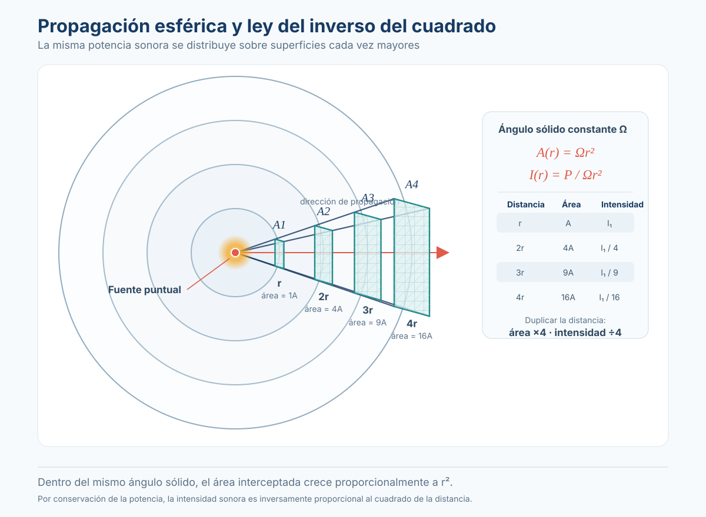
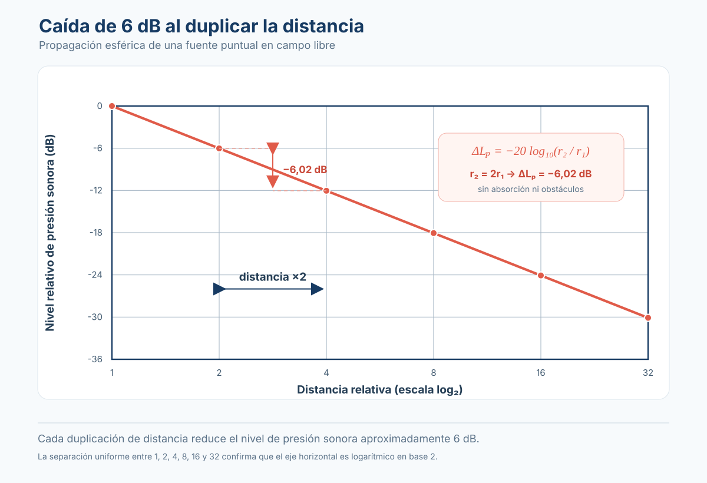

# Sesión 9: Propagación en campo libre

---

??? info "Unidades y símbolos (glosario de referencia)"
    Consultá esta tabla cuando encuentres una unidad o símbolo que no conozcas. Cada término en el texto está vinculado a esta tabla.

    | Símbolo | Nombre | ¿Qué mide? | Equivalencia |
    |---|---|---|---|
    | **dB** | Decibel | Nivel relativo (escala logarítmica) | \( \text{dB} = 10\log_{10}(P/P_0) \) |
    | **dB SPL** | Sound Pressure Level | Nivel de presión sonora | Referencia: \(p_0 = 20\ \mu\text{Pa}\) |
    | **dB SWL** | Sound Power Level | Nivel de potencia sonora de la fuente | Referencia: \(W_0 = 10^{-12}\ \text{W}\) |
    | **Hz** | Hertz | Frecuencia | 1 Hz = 1/s |
    | **kHz** | Kilohertz | Frecuencia | 1 kHz = 1,000 Hz |
    | **m** | Metro | Longitud, distancia | — |
    | **cm** | Centímetro | Longitud | 1 cm = 0.01 m |
    | **r** | Distancia desde la fuente | Distancia entre centro acústico de la fuente y punto de medición | En metros (m) |
    | **W** | Watt (Vatio) | Potencia acústica | 1 W = 1 J/s |
    | **W/m²** | Watt por metro cuadrado | Intensidad sonora | Potencia por unidad de área |
    | **Pa** | Pascal | Presión | 1 Pa = 1 N/m² |

???+ note "¿Qué es el campo libre?"

    Un **campo libre** (*free field*) es un espacio ideal donde el sonido se propaga sin obstáculos, reflexiones ni absorción del entorno. En un campo libre perfecto, la única atenuación que sufre el sonido al alejarse de la fuente es la **divergencia geométrica**: la energía se reparte sobre una superficie cada vez mayor.

    | Condición | Campo libre ideal | Realidad |
    |---|---|---|
    | Reflexiones | Ninguna (cero) | Existen, pero se minimizan — paredes absorbentes, techos altos |
    | Obstáculos | Ninguno | Ninguno o muy lejanos |
    | Medio | Aire homogéneo, sin viento, sin gradientes de temperatura | Aire real: hay viento, temperatura varía con altura |
    | Ejemplos | Cámara anecoica | Campo abierto (lejos de edificios), concierto al aire libre, medición en cámara semianecoica |

    !!! info "La cámara anecoica"
        Es el laboratorio que más se aproxima al campo libre ideal. Las paredes, techo y suelo están cubiertos con cuñas de material absorbente (fibra de vidrio, espuma acústica) que eliminan prácticamente todas las reflexiones por encima de una frecuencia de corte (típicamente 100 Hz). El suelo suele ser una rejilla metálica para caminar sin reflejar. Dentro de una cámara anecoica, el silencio es tan absoluto que la gente escucha su propia circulación sanguínea.

        **Para profundizar:** [¿Sabes qué es una cámara anecoica? — Blog de Panasonic](https://blog.panasonic.es/tecnologia/sabes-que-es-una-camara-anecoica-tecnologia-punta-para-el-panasonic-toughbook/){:target="_blank"} — un ejemplo real de cómo la industria usa cámaras anecoicas (en este caso, electromagnéticas) para probar dispositivos inalámbricos.

???+ note "Divergencia esférica y la ley del inverso del cuadrado"

    Cuando una **fuente puntual** (una fuente pequeña comparada con la longitud de onda que emite) radia sonido, la energía se expande en todas direcciones formando un frente de onda esférico. A medida que el radio de la esfera crece, la misma energía se distribuye sobre un área mayor.

    | Distancia \(r\) | Área de la esfera \(4\pi r^2\) | Intensidad \(I = W / 4\pi r^2\) | ¿Qué pasó con la intensidad? |
    |---|---|---|---|
    | 1 m | \(4\pi \approx 12.57\ \text{m}^2\) | \(W / 12.57\) | Referencia |
    | 2 m | \(16\pi \approx 50.27\ \text{m}^2\) | \(W / 50.27\) | Se dividió entre 4 (×¼) |
    | 4 m | \(64\pi \approx 201.06\ \text{m}^2\) | \(W / 201.06\) | Se dividió entre 16 (×1/16) |

    La intensidad cae como \(1/r^2\). En decibeles:

    \[
    \boxed{\text{SPL}(r_2) = \text{SPL}(r_1) + 20 \cdot \log_{10}\left(\frac{r_1}{r_2}\right)}
    \]

    | Símbolo | Nombre | Significado |
    |---|---|---|
    | \(\text{SPL}(r_1)\) | Nivel de presión sonora a distancia \(r_1\) | Nivel conocido en un punto de referencia (ej: sensibilidad del altavoz a 1 m) |
    | \(\text{SPL}(r_2)\) | Nivel de presión sonora a distancia \(r_2\) | El nivel que queremos predecir |
    | \(r_1\) | Distancia de referencia | Generalmente 1 m |
    | \(r_2\) | Distancia al punto de interés | Siempre mayor que \(r_1\) para predicción de pérdidas |

    ### Consecuencia directa: −6 dB por duplicación

    Si \(r_2 = 2 \cdot r_1\):
    \[
    \text{SPL}(2r) = \text{SPL}(r) + 20 \cdot \log_{10}(1/2) = \text{SPL}(r) + 20 \cdot (-0.301) \approx \text{SPL}(r) - 6\ \text{dB}
    \]

    <figure markdown="span">
      
      <figcaption>**Fig. 3-1** — Fuente puntual con divergencia esférica. La energía se distribuye sobre superficies esféricas concéntricas. Al duplicar la distancia, el área se cuadruplica y la intensidad cae a ¼ → −6 dB.</figcaption>
    </figure>

    [🎛️ **Abrir simulación interactiva — Festival al aire libre**](../../../simulacion/festival-campo-libre.html){ .md-button }

    Mueve al espectador entre 1 y 32 metros, ajusta el nivel inicial y el factor de directividad Q. Observa el nivel recibido, la pérdida por distancia y la potencia necesaria para compensar.

    !!! warning "Esto asume campo libre y fuente puntual"
        Si hay superficies reflectantes cerca (suelo, paredes), la caída real será menor porque las reflexiones suman energía. Si la fuente no es puntual (line array, fuente plana), la caída también es distinta (−3 dB para lineal, ~0 dB para plana en campo cercano). La ley del inverso del cuadrado es un **límite teórico máximo de atenuación** por distancia en campo libre.

???+ note "Relación entre SWL y SPL en campo libre"

    Conociendo la potencia sonora de una fuente (dB SWL) y sabiendo que estamos en campo libre, podemos predecir el SPL a cualquier distancia:

    \[
    \boxed{\text{SPL}(r) = \text{SWL} + 10 \cdot \log_{10}\left(\frac{Q}{4\pi r^2}\right) + 10.8\ \text{dB}}
    \]

    | Símbolo | Nombre | Significado |
    |---|---|---|
    | \(\text{SPL}(r)\) | Nivel de presión sonora a distancia \(r\) | Predicción en dB SPL |
    | \(\text{SWL}\) | Nivel de potencia sonora de la fuente | En dB SWL (re: 10⁻¹² W) |
    | \(Q\) | Factor de directividad | Q = 1 (omnidireccional), Q = 2 (sobre suelo), Q = 4 (esquina), Q = 8 (rincón) |
    | \(r\) | Distancia desde el centro acústico | En metros |
    | \(+10.8\ \text{dB}\) | Constante de conversión | Diferencia entre presión e intensidad en condiciones atmosféricas estándar (ρc = 400 rayls) |

    <figure markdown="span">
      
      <figcaption>**Fig. 3-2** — Nivel de presión sonora vs. distancia para una fuente puntual. Todas las curvas tienen la misma pendiente (−6 dB por duplicación de distancia), solo están desplazadas verticalmente según el SWL de cada fuente.</figcaption>
    </figure>

    ### Ejemplo práctico

    Un parlante de PA tiene SWL = 120 dB, Q = 2 (montado sobre el escenario, emite en hemiesfera). ¿Qué SPL llega a un espectador a 20 m?

    \[
    \begin{aligned}
    \text{SPL}(20) &= 120 + 10 \cdot \log_{10}\left(\frac{2}{4\pi \cdot 400}\right) + 10.8 \\[4pt]
    &= 120 + 10 \cdot \log_{10}\left(\frac{2}{5026.5}\right) + 10.8 \\[4pt]
    &= 120 + 10 \cdot \log_{10}(0.000398) + 10.8 \\[4pt]
    &= 120 + 10 \cdot (-3.4) + 10.8 \\[4pt]
    &= 120 - 34 + 10.8 = \mathbf{96.8\ \text{dB SPL}}
    \end{aligned}
    \]

    A 20 m, con un parlante de 120 dB SWL, el espectador recibe unos 97 dB SPL — un nivel adecuado para un concierto.

???+ note "Atenuación con la distancia: tabla rápida para trabajo en campo"

    Para una fuente puntual omnidireccional (Q = 1) en campo libre:

    | Distancia | Pérdida respecto a 1 m | Factor de pérdida de presión | ¿Qué significa? |
    |---|---|---|---|
    | 1 m | 0 dB | ×1.0 | Referencia |
    | 2 m | −6 dB | ×0.5 | La presión se redujo a la mitad |
    | 3 m | −9.5 dB | ×0.33 | Un tercio de la presión |
    | 4 m | −12 dB | ×0.25 | Un cuarto de la presión |
    | 5 m | −14 dB | ×0.20 | |
    | 8 m | −18 dB | ×0.125 | |
    | 10 m | −20 dB | ×0.10 | Un décimo de la presión original |
    | 16 m | −24 dB | ×0.0625 | |
    | 20 m | −26 dB | ×0.05 | |
    | 32 m | −30 dB | ×0.031 | |
    | 50 m | −34 dB | ×0.02 | |
    | 100 m | −40 dB | ×0.01 | 1% de la presión original |

    !!! tip "Regla de compensación de potencia"
        Para compensar una duplicación de distancia y mantener el mismo SPL, necesitás **cuadruplicar la potencia del amplificador** (+6 dB = ×4 en potencia). Para compensar una distancia 10× mayor (−20 dB), necesitás **100 veces más potencia**. Por eso llenar un estadio requiere decenas de miles de vatios.

???+ note "Campo libre vs. campo real: ¿qué cambia en la práctica?"

    En el mundo real, el campo libre perfecto no existe. Cada desviación modifica la atenuación predicha:

    | Fenómeno | Efecto sobre la atenuación | Dirección del error |
    |---|---|---|
    | **Reflexión del suelo** | Suma energía al receptor (puede sumar hasta +6 dB si está en fase) | El SPL real es MAYOR que el predicho por campo libre |
    | **Absorción atmosférica** | Atenúa más los agudos (depende de humedad, temperatura y frecuencia) | El SPL real es MENOR que el predicho (especialmente en agudos y a larga distancia) |
    | **Viento y gradientes de temperatura** | Curvan las trayectorias del sonido hacia arriba (contra el viento/día) o hacia abajo (a favor del viento/noche) | El SPL real puede ser MUCHO menor (zona de sombra) o mayor de lo esperado |
    | **Obstáculos y barreras** | Atenúan por difracción (el sonido «dobla» parcialmente las esquinas) | El SPL real es MENOR que el predicho |
    | **Directividad de la fuente** | La fuente no emite igual en todas direcciones — Q > 1 concentra energía | El SPL en el eje principal es MAYOR que el predicho para fuente omnidireccional |

    > Insertar **Fig. 3-3** del Everest: comparación entre atenuación teórica (campo libre) y mediciones reales en exteriores — se observa cómo a distancias cortas (<10 m) la ley del inverso del cuadrado domina, pero a distancias largas (>50 m) la absorción atmosférica y otros efectos se vuelven significativos.

    !!! info "En producción musical al aire libre"
        Cuando diseñás un sistema de sonido para un festival al aire libre, la ley del inverso del cuadrado es tu primer cálculo. Pero necesitás corregir por: (1) absorción atmosférica en agudos (los tweeters pierden más), (2) dirección del viento (el sonido viaja mejor a favor del viento), (3) temperatura (de noche el sonido «rebota» en capas de aire caliente y llega más lejos), (4) humedad (el aire seco atenúa más los agudos). Son correcciones que veremos en las próximas sesiones.

---

*Basado en: Everest, F. A. & Pohlmann, K. C. (2009). Master Handbook of Acoustics (5th ed.). McGraw-Hill. Capítulo 3, pp. 31–45 (Sound in the Free Field — Spherical Divergence, Inverse Square Law, Free Field vs. Real Conditions).*
